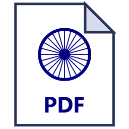

<p align="center">
  
</p>

<h1 align="center">Mark's Render PDF Editor</h1>

<p align="center"><b>A free, portable PDF editor for Windows – no install, no account, nothing uploaded.</b></p>

<p align="center">
  <a href="https://github.com/sttechnllc/render_pdf/releases/latest"></a>
  <a href="https://github.com/sttechnllc/render_pdf/releases"></a>
  
  
</p>

---

## Download

**[⬇ Download the latest release](https://github.com/sttechnllc/render_pdf/releases/latest)**, then pick one:

- **`MarksRenderPDFEditor-Setup.exe`**: installs it (Start menu + desktop shortcut, "Open with" for PDFs). No admin rights needed; remove it any time in *Settings → Apps*.
- **`MarksRenderPDFEditor.exe`**: the portable version. Nothing to install; run it from anywhere, even a USB stick.
- `.zip`: the portable version zipped, if you need to email it.
- **Mac:** `MarksRenderPDFEditor-mac.dmg`: open it and drag the app onto Applications. First launch: *System Settings → Privacy & Security → Open Anyway* (one time).

IT/scripted installs: `MarksRenderPDFEditor-Setup.exe --quiet` (silent), uninstall with `--uninstall --quiet`.

- Drag a PDF onto the exe, or right-click a PDF → **Open with** → the exe.
- `PDFEditor.html` is the same app and runs in any modern browser.
- It uses the Edge engine that comes with Windows, so it works without internet.

> **Windows SmartScreen warning?** The exe isn't code-signed, so Windows may say *"Windows protected your PC"*.
> Click **More info** → **Run anyway**.

## Features

**Edit**
- True text editing: click any text and retype it. The old characters are really removed from the PDF, and the PDF's own font is reused where possible.
- Add text, date, ✔ / ✘, images, highlights, whiteout and freehand drawing.

**Sign & fill**
- Signatures (draw, type or upload), remembered for next time.
- Fill forms (text boxes, checkboxes, dropdowns). Fields stay fillable after saving.
- Auto-fill profiles (name, address and so on), with optional password encryption.

**Pages**
- Reorder (drag), rotate, delete, insert blank pages, extract ranges (e.g. `1-3, 7`).
- Merge PDFs by dropping files on the page list.

**Select area** (`A`)
- Drag a box to copy text (Windows OCR for scans), copy it as an image, or move/duplicate that part.

**Search**
- Advanced search with modes and presets, **Redact all** and **Replace all**.

**Navigation**
- Contents/bookmarks, a smart headings index, go to page, zoom.

**Tools**
- Shrink PDF · extract images to ZIP · convert to images / Word / text / Markdown
- OCR a whole document into a searchable PDF
- Split · page numbers, headers, Bates numbering, watermark
- Compare two PDFs · batch processing
- Organize: remove blank pages, reverse, keep odd/even, duplicate
- Resize pages to Letter/A4/Legal · 2 or 4 pages per sheet · flatten forms · edit title/author
- **ZIP files (WinZip-style):** make a ZIP from files or folders, open a ZIP, extract to a folder, open PDFs straight from a ZIP

**Privacy**
- 100% local. Your files never leave your PC. Profiles and signatures are stored on this PC only.

## Keyboard shortcuts

| Key | Action | Key | Action |
|---|---|---|---|
| `V` | Select | `Ctrl+C` / `Ctrl+V` / `Ctrl+D` | Copy / paste / duplicate |
| `A` | Select area | `Ctrl+F` | Search |
| `E` | Edit text | `F3` / `Shift+F3` | Next / previous match |
| `T` | Add text | `Ctrl+G` | Go to page |
| `S` | Sign | `Home` / `End` | First / last page |
| `H` | Highlight | `PageUp` / `PageDown` | Previous / next page |
| `W` | Whiteout | `Ctrl +` / `Ctrl −` / `Ctrl 0`, `Ctrl+wheel` | Zoom in / out / reset |
| `D` | Draw | `Ctrl+Z` / `Ctrl+Y` | Undo / redo |
| `C` | Check ✔ | `Ctrl+S` / `Ctrl+Shift+S` | Save / Save as |
| `X` | Cross ✘ | `Ctrl+P` | Print |
| `?` | All shortcuts | | |

## Support the project

If this saves you a subscription, consider buying me a coffee ☕

[](https://www.buymeacoffee.com/nordberg)

## Building from source

Requirements: **Windows 10/11** and **Node.js 18+**.

```sh
npm ci
npm run build
```

Outputs in `dist/`:
- `Mark's Render PDF Editor.exe`: the portable app
- `PDFEditor.html`: the same app as a single HTML file

The launcher is compiled with the C# compiler built into the .NET Framework that ships with Windows,
so you don't need Visual Studio. Edit the code in `src/` and rebuild. Tagging `v*` triggers the GitHub
Actions release workflow.

## How it works

- **pdf.js** renders pages and **pdf-lib** (+ fontkit) writes the edited PDF.
- Everything is bundled into one self-contained HTML file, embedded in a tiny native launcher that opens it in an Edge app window.
- OCR uses Windows' built-in `Windows.Media.Ocr` through a local-only, token-protected helper. Nothing goes over the network.

## Credits

Built on [pdf.js](https://github.com/mozilla/pdf.js), [pdf-lib](https://github.com/Hopding/pdf-lib) and
[@pdf-lib/fontkit](https://github.com/Hopding/fontkit). See [THIRD_PARTY_NOTICES.md](THIRD_PARTY_NOTICES.md).

## License

[MIT](LICENSE) © 2026 Mark's Render PDF Editor contributors
